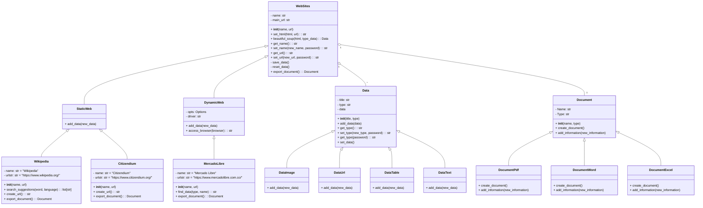

# Programación Orientada a Objetos - UNAL
## Proyecto Final
Este grupo de nombre **Bizarre Coding Adventure** conformado por las personas **Juan Sebastian Peñuela Duran**,
**Nicolas Steven Galvis Ordoñez** y **Andres Arturo Lozano Olivares** realizará la alternativa 2 **(Sistema de Web Scraping)**

### Definición de alternativa
Un sistema de web scraping es una herramienta que permite extraer datos de sitios web de forma automática (Algo así como un copiar y pegar mucho más eficiente). Estos datos se estructuran y se presentan en formatos como: JSON, CSV, Excel, etc.
Este sistema es utilizado en actividades como el monitoreo de precios (acciones, aplicaciones, juegos, indumentaria, etc), monitoreo de páginas en internet de interés propio o colectivo, estudios poblacionales y estadísticos, entre otros. En resumen, la función de un sistema de web scraping es **recopilar datos**, con los cuales es común construir información para satisfacer la necesidad y el interés del usuario. En este caso, se busca extraer datos de páginas web estáticas, como lo son las **wikis**, y de paginas web de sitios de retail, como **Mercado libre** o **Airbnb**.

Además, como **Feature Extra**, se generaran reportes en forma de documentos de la información recopilada de estos sitios, para darle mas profesionalismo a nuestro programa.

**Consideraciones legales del web scraping**
El web scraping no es ilegal por sí mismo. Sin embargo, se deben tener en cuenta los permisos que la página web que se intenta manipular otorgue, los cuales están determinados en los **términos y condiciones**. Es necesario tener cuidado con lo que se intenta scrapear, la ley 1581 de 2012, también conocida como la **Ley de protección de datos personales**, establece parámetros que se deben cumplir al momento de manipular datos privados de cualquier individuo, los cuales abarcan el consentimiento, la finalidad, y la garantía de su seguridad.

## Diagrama de clases

Hemos planteada inicialmente el siguiente *diagrama de clases* para nuestro codigo, este sera el esqueleto del cual partiremos para programar nuestro sistema:

## Solución Preliminar
Haremos un codigo, el cual sea capaz de recopilar informacion util de disntintas paginas web, ya sean wikis o paginas de compra, y retornar toda esta información, de manera organizada, en un documento, apto para la lectura y analisis de la misma.

