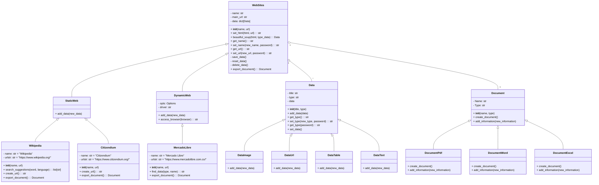

# Programación Orientada a Objetos - UNAL
## Proyecto Final
Este grupo de nombre **Bizarre Coding Adventure** conformado por las personas **Juan Sebastian Peñuela Duran**, **Nicolas Steven Galvis Ordoñez** y **Andres Arturo Lozano Olivares** realizará la alternativa 2 **(Sistema de Web Scraping)**


### Definición de alternativa
Un sistema de Web scraping, es una manera de extraer datos de paginas en linea, de manera automatizada, (Algo asi como un copiar y pegar mucho mas eficiente), esto aprovechando la estructura html de las páginas web para raspar datos según su etiqueta, estos datos son almacenados para su posterior exportación por medio de distintos tipos de documentos). Estos datos ya obtenidos se pueden usar de distintas maneras, ya sea el monitoreo de precios (De acciones, aplicaciones, juegos, indumentaria, etc), o monitorear las paginas en internet de entidades de interes propio.

Como se puede observar, la principal función de este sistema, es **recopilar información** que pueda ser de utilidad para el usuario.

### Método Básico de Web Scraping
- Primero se tiene que solicitar el "esqueleto de la página", esto no siempre es posible, ya que depende mucho del **API** de la página y de si esta es dinámica o estática (de esto se profundizará más tarde). El método **requests.get** cumple con esta función.
- Luego se requiere recorrer el código y buscar las etiquetas asociadas a la información buscada, esto se hace con **BeatifulSoup** y sus métodos
- Una vez obtenida la información dependiendo de lo que se busca esta se alamcena, se exporta, se imprime, etc.
```python
  #Importa las librerías
  from bs4 import BeautifulSoup
  import requests
  
  html = requests.get("https://es.wikipedia.org/wiki/C%C3%A9lula_vegetal").text #Se solicita y extrae el html de la página
  bs = BeautifulSoup(html, "lxml") #Analiza el html (usa lxml que estructurar el código para poder leer o modificar)
  prueba = bs.find_all("p") #Busca todos los párrafos basándose en la etiqueta <p> 
  for parrafo in prueba:
    texto = parrafo.text.strip() #Se usa strip() para borrar espacios en blanco innecesarios, saltos de linea, etc.
    if texto:
      print(texto) #Se imprimen todos los párrafos en texto
      
```
Esta forma resulta muy sencilla dependiendo del tipo de web, ya que existen algunas páginas que presentan más dificultades al momento de realizar Web Scraping. Así, se pueden clasificar las páginas web en dos tipos cuya característica resulta ser clave para scrapear datos:
- **Webs estáticas**: Su contenido es igual para todo usuario y solo se puede cambiar manualmente.
- **Web dinámicas**: Su contenido cambia dependiendo del tipo de usuario y la interacción con los datos.

Estas últimas requieren pasos extra dada su forma de cargar información (envía un html básico que puede estar vacío o falto de información y luego se genera contenido de manera dinámica). Estos pasos consisten en:
- Simular un navegador que acceda a la página y esperar que cargue el contenido.
- Relizar los pasos anteriores (sin usar requests) teniendo en cuenta la diferencia entre etiquetas.
```python
  #Importa las librerías
  from bs4 import BeautifulSoup
  from selenium import webdriver
  import time

  #Simula y accede al navegador
  driver = webdriver.Chrome()
  driver.get("https://listado.mercadolibre.com.co/rtx-3090#D[A:rtx%203090]")

  time.sleep(10) #Tiempo de espera de carga para la página
  html = driver.page_source #Obtiene el html dinámico
  
  bs = BeautifulSoup(html, "lxml") #Analiza el html (usa lxml que estructurar el código para poder leer o modificar)

  productos = bs.find("ol", class_="ui-search-layout ui-search-layout--stack") #Busca el contenedor de los productos

  #Busca cada nombre de un producto en el contenedor, usa strip() para eliminar espacio innecesario e imprime el nombre si este existe, si no imprime "sin nombre"
  for producto in productos:
      nombre_tag = producto.find("h3", class_="poly-component__title-wrapper") 
      nombre = nombre_tag.text.strip() if nombre_tag else "Sin nombre"
      print(nombre)
```
Como se puede ver, para realizar estos métodos hay que tener conocimiento de cómo se usan las etiquetas en cada página web, si esta página es dinámica o estática.

### Importancia del API
El API de una página web nos dice que tanto acceso se le permite a un software acceder y solicitar datos de dicha, página esto planteando reglas y restricciones. Este proceso puede evitar el uso de web scraping (aunque no es el objetivo de este proyecto) o mejorar la experiencia del usuario al momento de realizarlo. También, este nos da la legalidad que debe tener el programa, por lo que es algo muy clave a tener en cuenta.

***(Ejemplo: Wikipedia posee un api de acceso público por lo que no hay limitaciones al extraer datos de la página siempre y cuando se respeten los derechos de autor)***


## Diagrama de clases

Hemos planteada inicialmente el siguiente *diagrama de clases* para nuestro codigo, este sera el esqueleto del cual partiremos para programar nuestro sistema:


## Solución Preliminar
La Solución que planteamos para esta alternativa, es un programa el cual sea capaz de recopilar datos utiles de distintas paginas web previamente escogidas, dando una perosanalización al modo y vista de los datos según que página y dependiendo de los permisos de la misma se pueden realizar métodos para mejorar la experiencia del usuario que use el programa.

### Funcionamiento del scrapeo de datos
Se caracteriza cada página (tres en este caso siendo Wikipedia, Mercado Libre y Citizendium) haciendo reconocimiento del tipo, sus etiquetas y sus clases. Una vez reconocidas a sabidas sus restricciones se pueden crear diferentes fomras facilitar el uso y mejorar la experiencia del usuario (Se crean formas de mejorar la experiencia del usuario dependiendo de la página).

***(Ejemplo: El API de wikipedia nos permite crear un generador de url automáticos para poder buscar urls relacionadas entre si y mejorar la experiencia de busqueda de datos, esto solicitando información a la página con respecto a búsquedas relacionadas entre si. Por otro lado Citizendium posee muchas más restricciones por lo que estos posibles métodos no son posibles de manera convencional.)***

### Generador de documentos
Como **Feature Extra**, se generan reportes en forma de documentos los datos requeridos de estos sitios, como se puede observar en el diagrama de clases. Estos documento son personalizables dependiendo del tipo de dato y las exigencias del usuarios **(se crea la clase Data y sus sub-clases para realizar una caracterización más profunda. Se crea la clase Documents y sub-clases, estos poseen sus métodos para la organización de los datos en los respectivos documentos según el tipo de dato y la solicitud del usuario)**.

### Interfaz gráfica
A modo de app para computador. Método de elaboración aún no definido.

### Paquetes y módulos
(La siguiente presentación es la general y puede tener cambios considerables):
```
  > scraping_project
    > exceptions
    > moduls
      > moduls_scraping
      > moduls_documnetation
    > gui
  - terms_conditions.txt
  - main.py
```
***(Esta muestra solo es una guia para el entendimiento y elaboración del programa y no se le debe dar demasiada importancia)***

### Medio de uso
El programa se usa por medio de la terminal de python, entregandole distintos datos que permiten la obtencion 

### **Consideraciones legales del web scraping**
El web scraping no es ilegal por sí mismo. Sin embargo, se deben tener en cuenta los permisos que la página web que se intenta manipular otorgue, los cuales están determinados en los **términos y condiciones**. Es necesario tener cuidado con lo que se intenta scrapear, la ley 1581 de 2012, también conocida como la **Ley de protección de datos personales**, establece parámetros que se deben cumplir al momento de manipular datos privados de cualquier individuo, los cuales abarcan el consentimiento, la finalidad, y la garantía de su seguridad.
